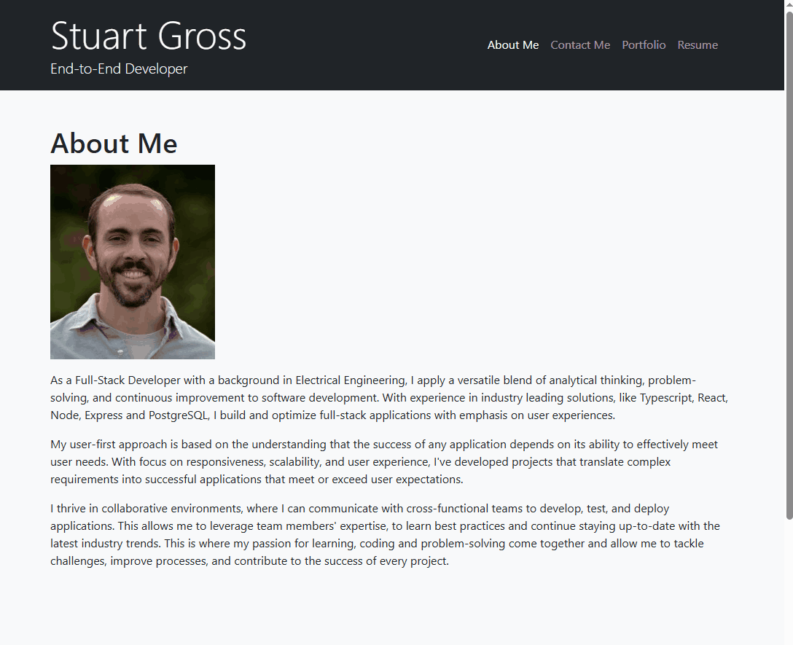

# React Portfolio

## Description

This project is a React-based portfolio designed to showcase web development skills and projects. It's built as a single-page application (SPA) to provide a seamless user experience, allowing potential employers and collaborators to easily navigate through various sections like "About Me," "Portfolio," "Contact," and "Resume." This portfolio is deployed on Netlify, ensuring accessibility and a professional presentation.

## User Story
As an employer looking for candidates with experience building single-page applications,
I want to view a potential employee's deployed React portfolio of work samples
so that I can assess whether they're a good candidate for an open position

## Acceptance Criteria

* The application presents a header, content sections, and a footer.
* The header includes the developer's name and navigation links: "About Me," "Portfolio," "Contact," and "Resume."
* Navigation highlights the current section.
* Clicking navigation links updates the displayed section without page reload.
* "About Me" section is displayed by default.
* "About Me" includes a photo/avatar and a bio.
* "Portfolio" displays six project images with links to deployed applications and GitHub repositories.
* "Contact" includes a form with name, email, and message fields, with validation.
* "Resume" provides a link to a downloadable resume and a list of proficiencies.
* The footer includes links to GitHub, LinkedIn, and a third platform (e.g., Stack Overflow, Twitter).

## Demo

## Technologies Used

* React
* React Router DOM
* Vite
* CSS Bootstrap
* JavaScript (ES6+)

## License

This project is licensed under the MIT License - see the [LICENSE](LICENSE) file for details.

## Deployed Application

[Netlify Deployment Link](https://end-to-end-by-stuart.netlify.app/)

## GitHub Repository

[GitHub Repository Link](https://github.com/sigros02/Module-12-Challenge-React-Portfolio)